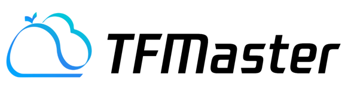
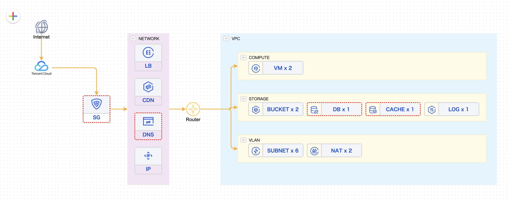

[English](README_EN.md) | 简体中文

TFMaster是一个用于展示业务云资源拓扑和资源使用的轻量级软件， 底层基于terraform，可以帮助你展示你的基础设施拓扑并快速定位变更差异。

目前已经支持的云厂商腾讯云

已经支持的基础资源：
vm: cvm,
bm,
lb: clb,
bucket: cos,
sg,
db:mysql,
cache:redis,
vpc,
subnet,
nat,
router,
disk,
ddos,
cdn,
ip,
k8s: tke,
iam,
user,
group,
aksk,
log: cls,
dns

## Overview
- [架构设计](docs/overview/architecture.md)
- [代码目录](docs/overview/code_framework.md)
- [设计理念](docs/overview/design.md)

## Features
- 通用云解决方案: 底层基于terraform协议做多云适配
- 贴近业务接入:  直观呈现业务部署方案和数据流向
- 资源差异对比:  快速定位到每次资源变化的差异情况

## Getting started
- [开发部署](docs/deploy/installation.md)
- [使用](docs/deploy/usage.md)

## BlueKing Community
- [BK-REPO](https://github.com/TencentBlueKing/bk-repo)：蓝鲸制品库是一个基于微服务架构设计的制品管理平台。
- [BK-CMDB](https://github.com/Tencent/bk-cmdb)：蓝鲸配置平台（蓝鲸CMDB）是一个面向资产及应用的企业级配置管理平台。

## Contributing
- 关于 TFMaster 分支管理、issue 以及 pr 规范，请阅读 [Contributing](CONTRIBUTING.md)
- [腾讯开源激励计划](https://opensource.tencent.com/contribution) 鼓励开发者的参与和贡献，期待你的加入

## License
TFMaster 是基于 MIT 协议， 详细请参考 [LICENSE](LICENSE.txt)

我们承诺未来不会更改适用于交付给任何人的当前项目版本的开源许可证（MIT 协议）。