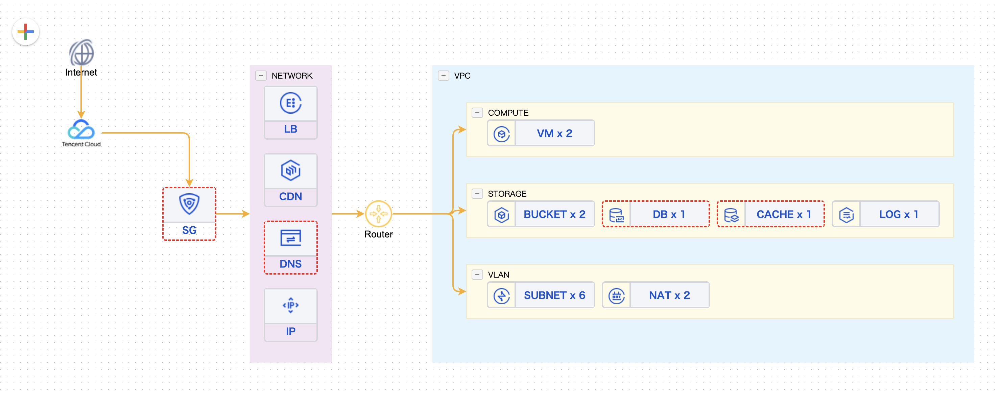
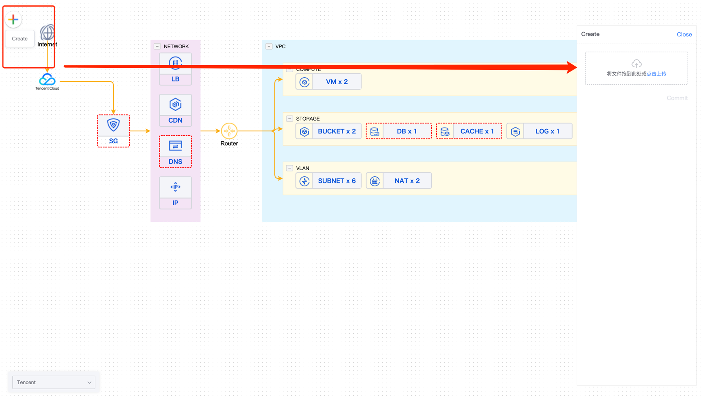
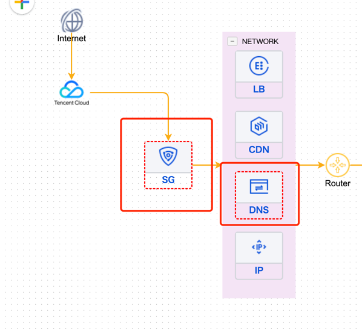
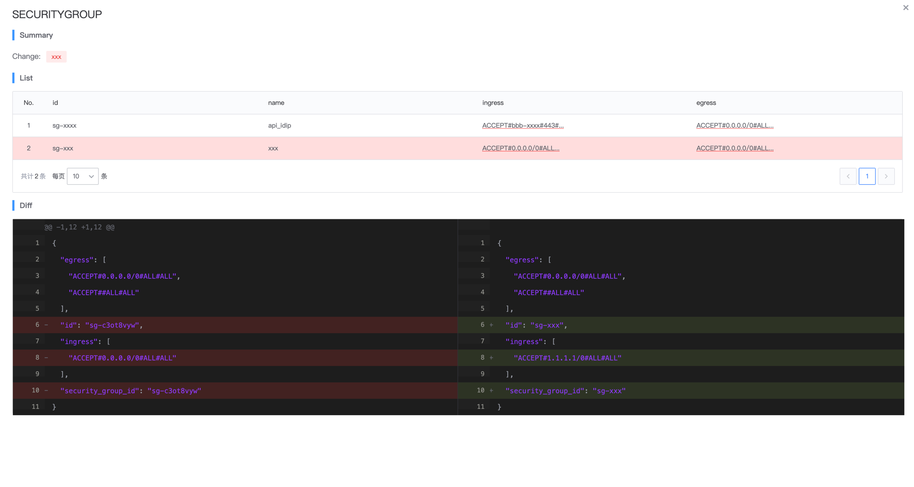

# TFMaster 使用文档

## 安装terraform
具体安装步骤参考[官网](https://www.terraform.io/)


## 生成基础设施当前State
```shell
# manual
terraform plan  -out=plan.out
terraform show -json plan.out > plan.json
```

## 上传plan.json


## 查看topo


## 更新plan.json


## 查看差异
找到存在红色边框的节点 双击查看


找到table中为红色的row，双击查看差异
